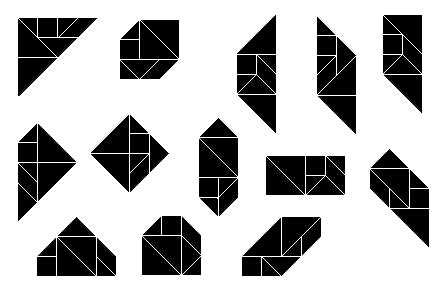

## Projet Tangram

Résolution d'un jeu de Tangram grâce au langage Prolog, dans le cadre de l'UV d'IA41 à l'UTBM.

### Utilisation

```
swipl -s main.pl
main(Dessin, Resultat).
% Dessin peut prendre les valeurs :
% triangle cube trapeze parallelogramme
% bizarre1 bizarre2 carre hexagone rectangle
% bizarre3 maison grange brique
```

Treize dessins actuellement répertoriés, les solutions possibles (entre autre) sont celles-ci:



Source : https://en.wikipedia.org/wiki/Tangram#Number_of_configurations

### Changelog

11/06 : ajout d'une visualisation des résultats.

10/06 : l'algo de recherche (Depth First Search) est en place, mais il n'y a aucune 
visualisation de résultat, à venir plus tard.